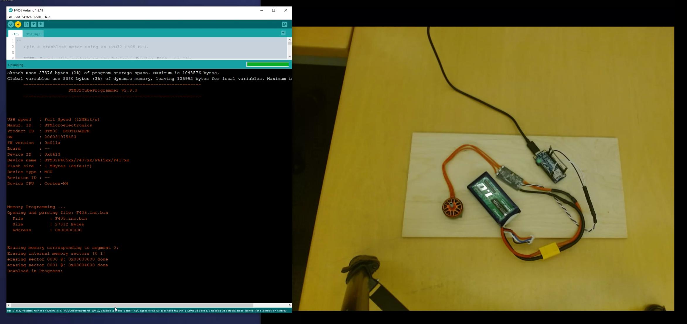

# DshotSTM32

This is a simple, header-only Arduino library for library for DSHOT protocol
on STM32 microcontrollers.  I adapted it from the driver code the driver code in
[Betaflight](https://github.com/betaflight/betaflight).
It currently does not support DSHOT telemetry.

## Use cases

I have used this library successfully with the following hardware:

* [BetaFVP 75mm Brushless Whoop Quadcopter](https://betafpv.com/products/beta75x-2s-whoop-quadcopter)

* [Diatone Cube 229 Brushless Quadcopter](https://www.diatoneusa.com/store/p659/Diatone_Toothpick_Cube_229_8500_PNF.html)

* [Adafruit STM32F405 Feather Express](https://learn.adafruit.com/adafruit-stm32f405-feather-express/) development board.

For all F405 boards (including the Adafruit STM32F405 Feather Express) you should select
the Generic F405RGTx part number in the Tools menu.

## Similar projects

* [stm32\_hal\_dshot](https://github.com/mokhwasomssi/stm32\_hal\_dshot)

* [DShotRMT](https://github.com/derdoktor667/DShotRMT)
